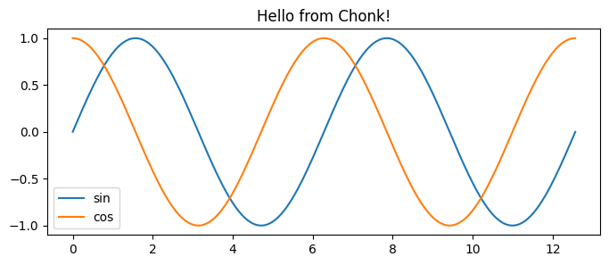

# demo


<!-- WARNING: THIS FILE WAS AUTOGENERATED! DO NOT EDIT! -->

``` python
from ipyfernel import *
```

# Getting Started

There are a few things we need to do to make sure this setup will
connect. One is the name of the remote kernel. Another is the validity
of the SSH connection.

## Register the remote kernel

Register which python executable you plan to use on the remote machine:

``` python
register_remote_kernel(remote_python='/Users/shawley/exercises/solveit/.venv/bin/python')
```

    ipyf_remote_kernel is already a registered kernel

## Setup SSH TCP Proxy

Make sure your SSH keys are up to date the following command will create
a new key and/or overwrite an old key and print the resulting public key
to the screen:

``` python
!ssh-keygen -t ed25519 -f ~/.ssh/id_ed25519 -N '' -q -y
```

    ssh-ed25519 AAAAC3NzaC1lZDI1NTE5AAAAIISw4Bii/B2kpnxN8Mo782wOFk/hDuLIAgqfmVY1KYHF solveit@e421467f4581

> **NOTE:** If you stop and start the SolveIt instance, the SSH key will
> probably go out of date, so you’ll need to run the above command to
> overwrite the old key.

Copy that output line and paste it into your remote machine’s
~/.ssh/`authorized_keys` file.

On the remote machine, setup a TCP proxy to port 22 (the ssh port) via
`bore`:

``` bash
bore local 22 --to bore.pub
```

…and note the port it assigns you, e.g. “`listening at bore.pub:10807`”
means your port is 10807. Note that bore.pub ports are only temporary,
but this should be fine for a single session.

### Quick Check- Manual SSH

Before going on, make sure that you’re able to manually SSH to the
remote system.

In the ***Terminal*** for solveit, try to ssh using your bore port and
username on the remote machine:

``` bash
 ssh -p <port> <username>@bore.pub
```

If that succeeds, you should be ready to go on.

## Start the Remote Kernel

Now you should be ready to start the remote kernel:

``` python
port, user = 10807, 'shawley'   # bore.pub and remote username
start_remote(port, user)
```

    /app/data/.ssh/config file updated.
    Success: remote kernel started

# Progress Bar

The remote execution has the same limitation that any other local
SolveIt progress bars might have, e.g. nothing with `\r` – so no `tqdm`
:-(. Here’s a simple one where the bar is a string that keeps getting
longer.

``` python
#%%remote  <-- this is the magic used for this cell
import time
import socket 
hostname = socket.gethostname()   # let's clarify that we're running remotely
print("We're executing on",hostname) 

def test_progbar():
    print("[", end="", flush=True)
    for i in range(20):
        print("=", end="", flush=True)
        time.sleep(0.15)
    print("] Done!")

test_progbar()
```

    We're executing on Chonk
    [====================] Done!

That worked! Chonk is the name of my remote laptop, and that progress
bar went across the screen in real time over the span of a few seconds.
For other types of progress bars, see \[TODO: Link to post by David or
Rens…?\]

# Matplotlib Plot

``` python
#%%remote <-- cell magic for this execution (not displayed by docs)
import socket
import matplotlib.pyplot as plt
import numpy as np
hostname = socket.gethostname()   # let's make sure we're running remotely

def test_plot():
    x = np.linspace(0, 4*np.pi, 200)
    plt.figure(figsize=(8,3))
    plt.plot(x, np.sin(x), label='sin')
    plt.plot(x, np.cos(x), label='cos')
    plt.title(f"Hello from {hostname}!")
    plt.legend()
    plt.show()

test_plot()
```



The host name and the title confirms where it’s being executed.

# GPU Execution

``` python
#%%remote 
import torch 
device = 'cuda' if torch.cuda.is_available() else 'mps' if torch.backends.mps.is_available() else 'cpu'
print("Device =",device)
```

    Device = mps

# ‘Sticky’ Remote Execution

Rather than using the `%%remote` magic for every cell, we can make it so
that cells execute remotely by default.

``` python
set_sticky()
```

    Code cells will now execute remotely.

Note: since the kernel is persistent, we don’t need to import `socket`
again.

``` python
print("We're executing on",socket.gethostname())  # Should say 'Chonk', i.e. remote latop
```

    We're executing on Chonk

The idea with sticky mode is to make it “transparent”, as if you’re
running the notebook on the remote machine,…which includes shell
commands:

``` python
# List the standard system apps on remote Mac laptop. 
!ls /System/Applications | head  -n 4
```

    App Store.app
    Apps.app
    Automator.app
    Books.app

(The local system runs Linux, which has no /System/Applications
directory)

We can temporarily override sticky mode’s redirect via the `%%local`
IPython magic:

``` python
#%%local    <--- magic for this cell
import socket 

print("We're executing on",socket.gethostname())
```

    We're executing on 549d6fca895f

``` python
unset_sticky()
```

    Code cells will now run locally.

``` python
# should be the same hostname as the previous local execution
print("We're executing on",socket.gethostname())
```

    We're executing on 549d6fca895f

# Shutting down

The remote kernel stays running, and if you don’t explicitly stop it,
you will eventually accumulate a whole bunch of zombie remote kernel
processes, so it’s good practice to remember to shut it down:

``` python
stop_remote()
```

    Code cells will now run locally.
    Shutting down remote kernel

------------------------------------------------------------------------

TODO: I never could get the magics to render in the docs, after many
hours of trying. So all I could figure out to do was to just add them as
comments.
